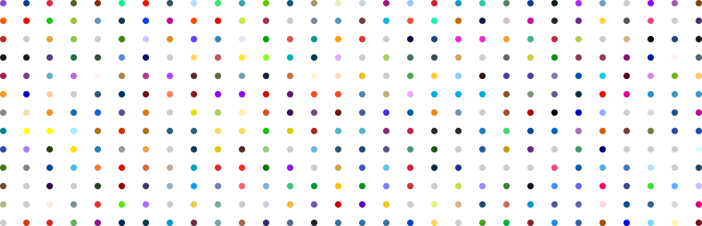

# CSS LangDot
Programming language color dots in CSS for your own website.



<p><a href="http://jigsaw.w3.org/css-validator/validator?lang=en&profile=css3svg&uri=https%3A%2F%2Fraw.githack.com%2Fkkmzero%2Fcss-langdot%2Fmain%2Fcss%2Flang.css&usermedium=all&vextwarning=&warning=1"></a></p>

## How to use

Copy and include ```css/lang.css``` file in your project:
```html
<link rel="stylesheet" href="css/lang.css">
```

or import the file from this repository via raw.githack.com in your own css file:
```css
@import url("https://raw.githack.com/kkmzero/css-langdot/main/css/lang.css");
```
</br>

Then use html code with typed-in programming language name:
```html
<span class="lang javascript"></span> JavaScript
```
</br>

Preview of all programming language color dots and their html codes can be found in file [list.html](list.html).
